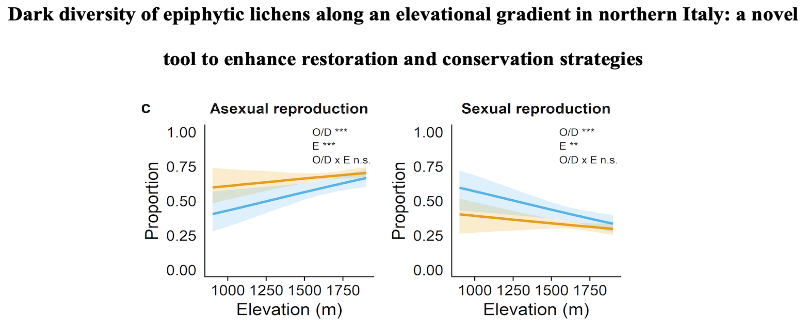
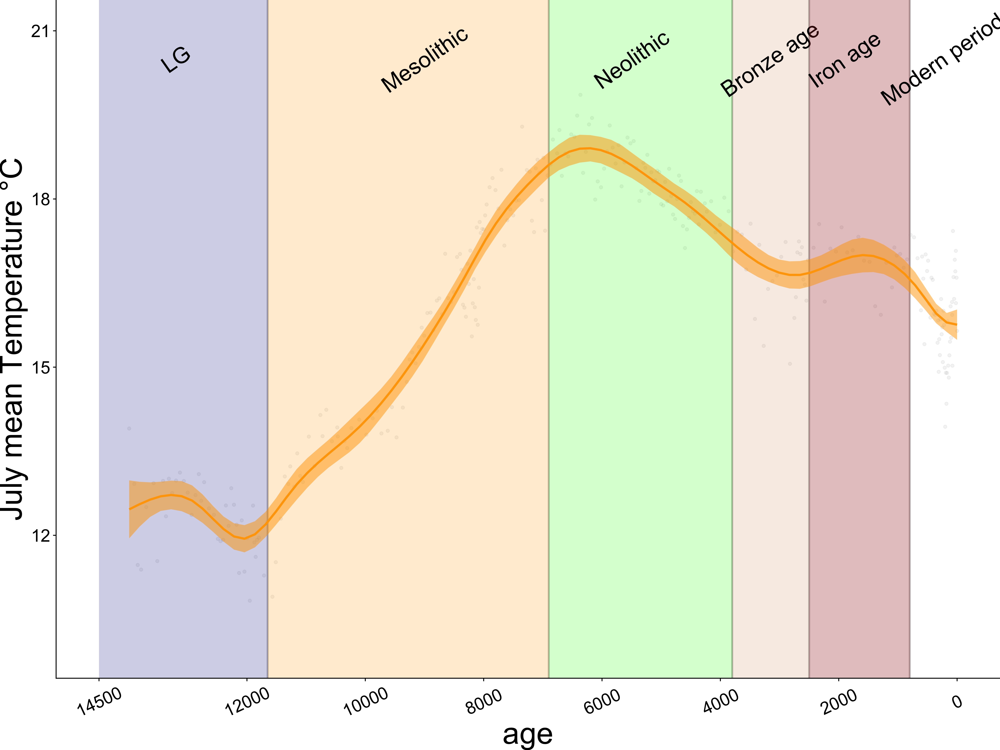
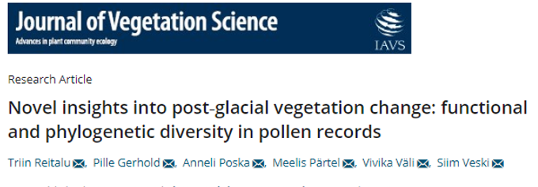
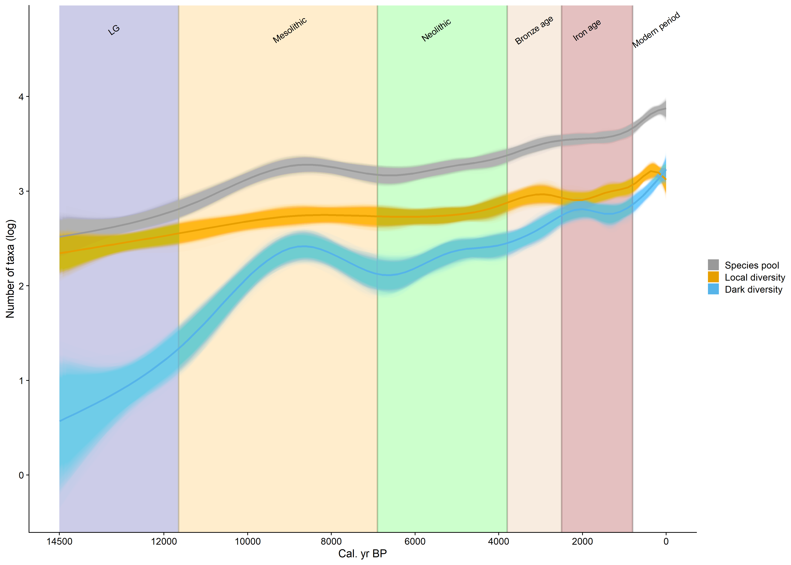
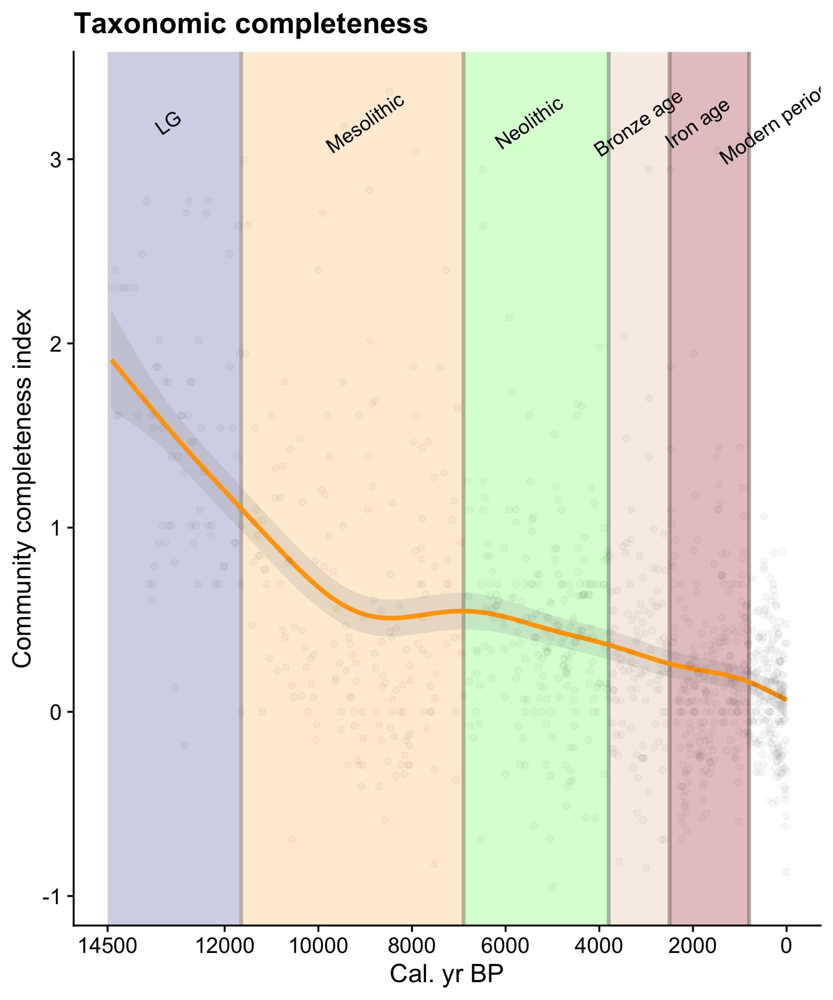
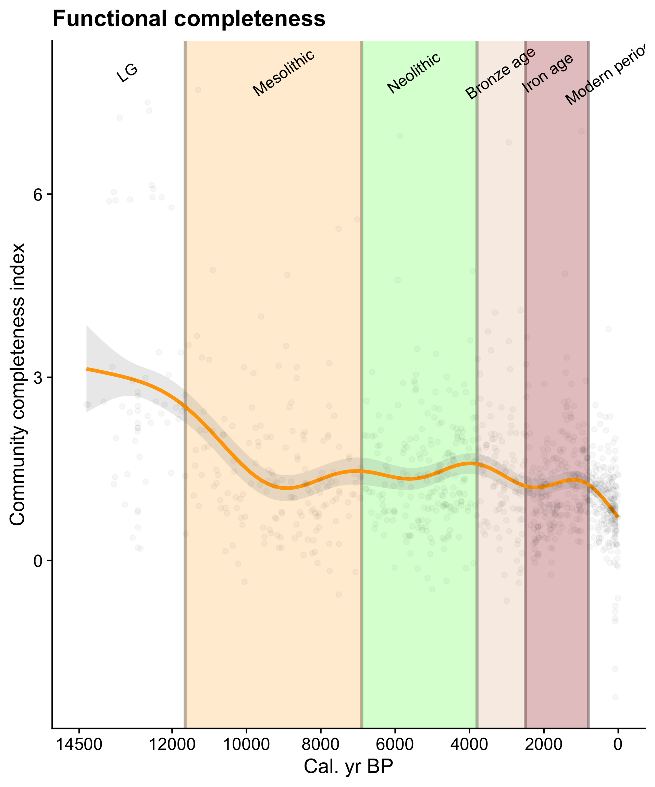
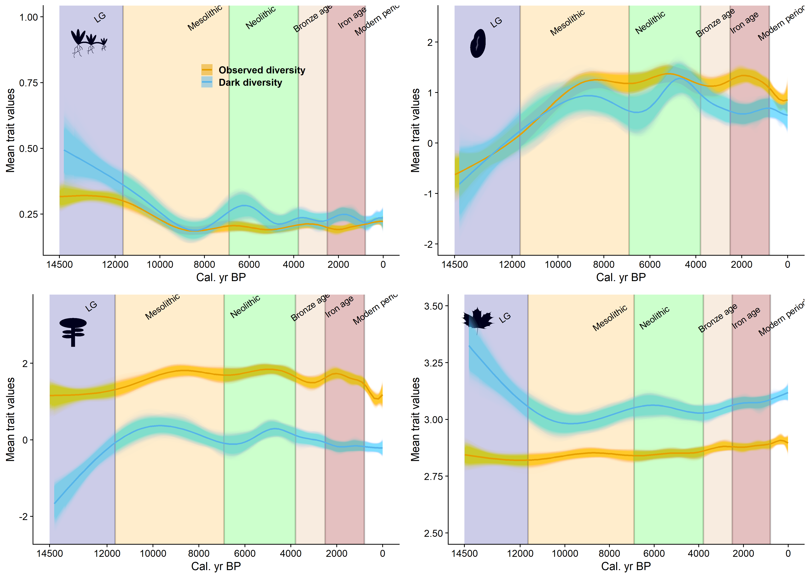

---
output:
  xaringan::moon_reader:
    css: ["my-css.css"]
    lib_dir: libs
    nature:
      highlightStyle: github
      highlightLines: true
      countIncrementalSlides: false
      seal: false
---


```{r setup, include=FALSE}
options(htmltools.dir.version = FALSE)
```


class: inverse, center, top

<div class="my-logo-left"></div>

<div class="my-logo-right"></div>

<br /> 
<br />
<br /><br />
<br />

# .small[Observed and dark diversity dynamics over the last 14,500 years in Northeastern Europe: taxonomic and functional analysis of pollen data]

<br />
#### .large[Diego Trindade]
##### .large[Macroecology workgroup]

--
##### .large[Meelis Pärtel, Carlos Carmona, Triin Reitalu]


---
class: inverse

### Dark diversity concept and the filtering metaphor


.pull-left[
```{r echo=FALSE, out.height= "20%", out.width="90%"}

include_graphics("assembly.jpeg")
```
]

<br>
<br>
--

- Dark diversity: **set of suitable but locally absent species**;

--

<br>

- Important to shed light on the process that govern local community assembly;

--

<br>

- Enables to assess how much of the species pool is realized within local site: community completeness (log(observed/dark));

<br>

- Useful metric to compare different regions, landscapes, taxa etc.


---

class: inverse

### Dark diversity reveals what species are missing..

#### .large[What about "why" species are missing?]

- We can use functional traits:

  - *Any morpho-physio-phenological traits that impact the fitness of individual species*

--

- Usually linked to dispersal and stress-tolerance

.pull-left[
```{r echo=FALSE, out.height= "10%", out.width="90%"}

include_graphics("kersti.png")
```
Riibak et al. 2015]

.pull-right[
```{r echo=FALSE, out.height= "10%", out.width="90%"}

include_graphics("moeslund.png")
```
Moeslund et al. 2017]
--
.center[
```{r echo=FALSE, out.height= "20%", out.width="52%"}


```
<br>Trindade et al. submitted]


---

class: inverse

### How site-specific species pools change over time?

.pull-left[
```{r echo=FALSE, out.height= "10%", out.width="85%"}

include_graphics("assembly.jpeg")
```
]

<br>

<br>


- Species pools are not static but evolving components of biodiversity

<br>

- This is rather important in a global change context

<br>

---
class: inverse

### Species gains and losses


.center[
```{r echo=FALSE, out.height= "20%", out.width="65%"}

include_graphics("https://diegopftrindade.netlify.app/img/fig_graphical_abs.png")
```
.pull-right[.small[Trindade, Carmona & Pärtel 2020, Global Change Biol.]]]


<br>
- Both species and traits will flow within and into/out the site-specific species pool over time

- However, how both observed and dark diversity dynamics change over time is still unknown

---
class: inverse

### Sedimentary pollen data

- Allows to reconstruct millennial time-scale vegetation dynamics

<br>


- Assess the effects of climate and land-use changes on biodiversity;

<br>

- Can provide insights on how vegetation will change in the future


<br>
<br>
.center[
```{r echo=FALSE, out.height= "20%", out.width="55%"}
# All defaults
library(knitr)
include_graphics("https://media.giphy.com/media/rULGb0wtaeAEM/giphy.gif")
```
]
---
class: inverse

### LG, Holocene and Archaeological periods in Estonia

.left-column-img[
```{r echo=FALSE,  out.width="70%"}


```

]

.right-column-txt[- Mesolithic: Natural succession from open birch to more closed forests

- Neolithic: Broad-leaved forests replaced the birch- and pine-dominated forests; Some species related to grazed areas.

- Bronze age: Cereal cultivation; formation of Estonian alvars

- Iron age: Forest clearances; introduction of arable farming; increasing population density

Poska & Saarse 1999; Poska et al. 2004]

---
class: inverse
### Aims

- Examining taxonomic and functional observed and dark diversity trends over millennial time scales

- Understanding how climate and human activities might have shaped observed and dark diversity of plants in NE Europe

### General expectations

- Both observed and dark diversity will increase over time, with marked differences between LG and Holocene period;

- Important functional changes during the Mid-Holocene (warmest period) and from the Bronze age (high land-use changes)

---
class: inverse

### Pollen data and dark diversity estimation

```{r echo=FALSE, out.height= "20%", out.width="80%"}
# All defaults
library(knitr)

```


- Sedimentary pollen data was collected in 20 Lakes in Estonia and Latvia;

- Radiocarbon dates;

- Data covers 14500 yr time span;

<br>

- Dark diversity was estimated using the Hypergeometric method in "DarkDiv" package

- Community completeness = ln(observed/dark)

---
class: inverse

### Functional traits and analyses

- Four traits: 

  - Specific leaf area (SLA);
  
  - Plant height; 
  
  - Clonality;
  
  - Seed weight;

- Functional diversity (Fric) - Trait probability density (TPD package);

- Functional composition - Mean trait value;

- Statistical analyses: Generalized additive models (GAMs)

---

class: inverse

#### .large[Observed and dark diversity increased over time]

```{r echo=FALSE, out.height= "20%", out.width="80%"}


```


- Observed and dark diversity increased after LG;

- Dark diversity increased rather fast after the LG and Mid-Holocene (6k years BP);
---

class: inverse


### Taxonomic completeness decreased almost linearly


```{r echo=FALSE, out.height= "20%", out.width="49%"}


```


- Taxonomic community completeness decreased sharply over the LG until mid-Mesolithic (~9k years BP) and over the Neolithic until present
---
class: inverse


#### Functional completeness decreased too, but less pronouced


```{r echo=FALSE, out.height= "20%", out.width="60%"}


```

---
class: inverse

### What about the functional composition?

```{r echo=FALSE, out.height= "20%", out.width="75%"}


```

- Species in dark diversity are those with high SLA and low Height (low persistence ability)

- Peaks in functional composition change during Mid-Holocene (clonality, seed mass and SLA)

---
class: inverse
### Highlights

- Both diversity and functional composition of species change from LG to Holocene;

- Despite the fast increase in dark diversity over the Holocene (lower community completeness), the functional completeness changed little

  - Functional redundancy
  
- Dark diversity species are linked to low persistence ability (large leaves and shorter species);
  
- Most evident effects of climate and human activities on observed and dark diversity:

  - Peak in SLA, Clonality and Seed mass in dark diversity during the Mid-Holocene;

  - Loss of taller and bigger seeded species in both observed and dark diversity from the Bronze Age (local and regional extinction)
  

---
class: inverse
### Take-home messages

- Dark diversity provides valuable information on how much, fast and in what direction species pools change over millennial scales;

- LG and Holocene have marked differences in terms of diversity and composition;

- Mid-Holocene changed little the observed diversity but more pronounced the dark diversity;

- Human activities have been shaping both observed and dark diversity from the Bronze age until present

--

.center[
```{r echo=FALSE, out.height= "20%", out.width="55%"}

include_graphics("https://media.giphy.com/media/R9BMyZ0Tu23Daa3Oxj/giphy.gif")


```
]
---
