---
output:
  xaringan::moon_reader:
    css: ["my-css.css"]
    lib_dir: libs
    nature:
      highlightStyle: github
      highlightLines: true
      countIncrementalSlides: false
      seal: false
---


```{r setup, include=FALSE}
options(htmltools.dir.version = FALSE)
library(xaringan)
library(rmarkdown)
library(knitr)
```


class: inverse, center, top

<div class="my-logo-left"></div>

<div class="my-logo-right"></div>

<br /> 
<br />
<br /><br />
<br />

# .small[Taxonomic and functional analysis of observed and dark diversity: dynamics over the last 14,500 years in Northern Europe]

<br />
#### .large[Diego Trindade]

##### .large[Carlos Carmona, Triin Reitalu, Meelis Pärtel]


##### .large[University of Tartu - Macroecology workgroup]


---
class: inverse

### Dark diversity concept and the filtering metaphor


.left-column-img[
```{r echo=FALSE, out.height= "20%", out.width="60%"}

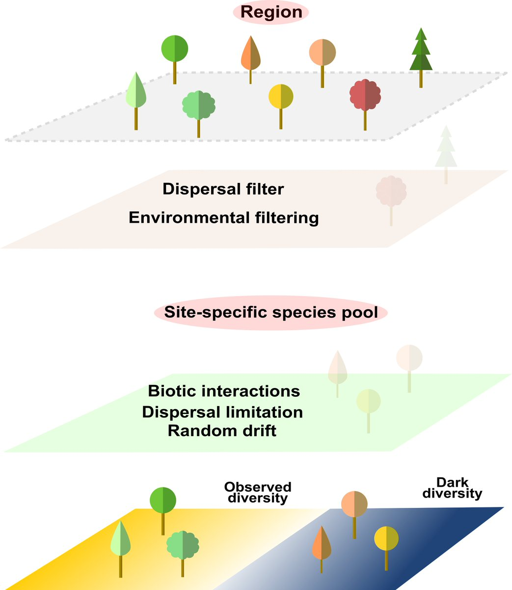
```
]

<br>
<br>
--
.pull-right[
- Dark diversity: **set of suitable but locally absent species**;

<br>

- Important to shed light on the process that govern local community assembly;

<br>

- Dark diversity is estimated based on co-occurrence of species;

<br>

- Enables to assess how much of the species pool is realized within local site: community completeness (log(observed/dark));

<br>

- Useful metric to compare different regions, landscapes, taxa etc.


]

---

class: inverse

### Dark diversity reveals what species are missing..

#### .large[But "why" are species missing?]

- We can use functional traits:

  - *Any morpho-physio-phenological traits that impact the fitness of individual species*

--

- Usually linked to dispersal and stress-tolerance

.pull-left[
```{r echo=FALSE, out.height= "10%", out.width="90%"}

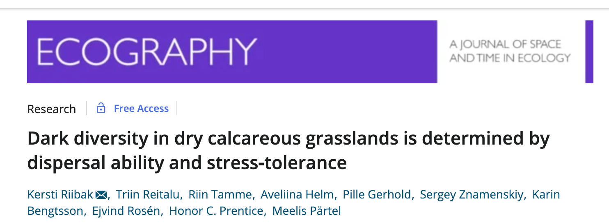
```
Riibak et al. 2015]

.pull-right[
```{r echo=FALSE, out.height= "10%", out.width="90%"}

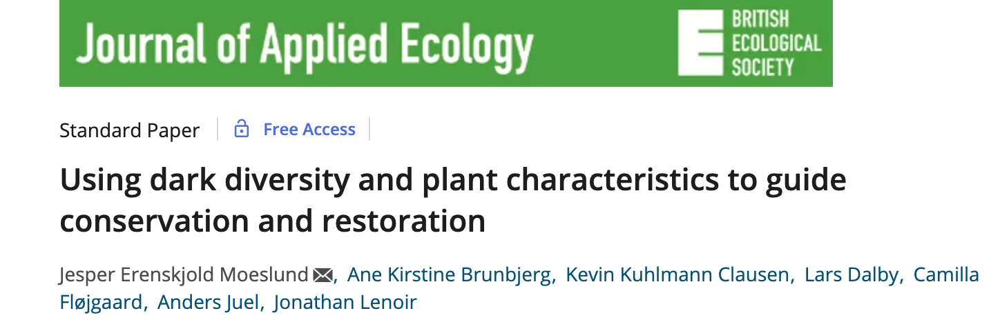
```
Moeslund et al. 2017]
--
.center[
```{r echo=FALSE, out.height= "20%", out.width="52%"}

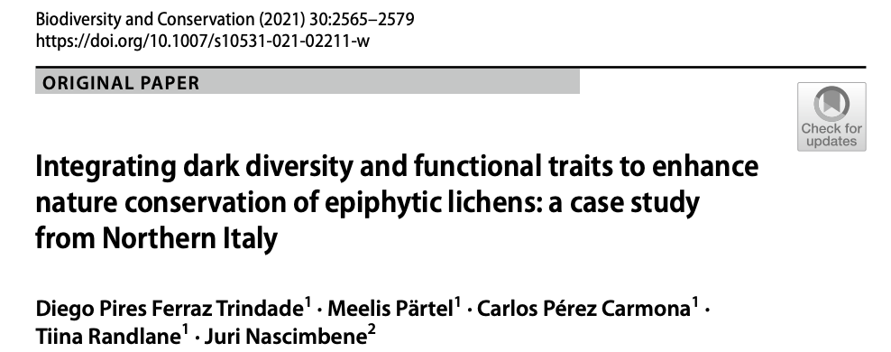
```
<br>Trindade et al. 2021]

---
class: inverse

### How site-specific species pools change over time?

.pull-left[
```{r echo=FALSE, out.height= "10%", out.width="85%"}


```
]

<br>

<br>


- Species pools are not static but evolving components of biodiversity

<br>

- This is rather important in a global change context

<br>

---
class: inverse

### Sedimentary pollen data

- Allows to reconstruct millennial time-scale vegetation dynamics

<br>


- Assess the effects of climate and land-use changes on biodiversity;

<br>

- Can provide insights on how vegetation will change in the future


<br>
<br>
.center[
```{r echo=FALSE, out.height= "20%", out.width="55%"}
# All defaults
library(knitr)
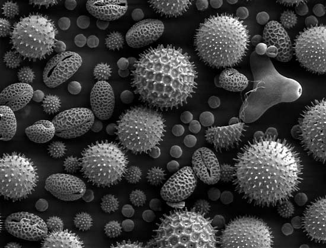
```
]
---
class: inverse

### LG, Holocene and Archaeological periods in NE Europe

.left-column-img[
```{r echo=FALSE,  out.width="70%"}

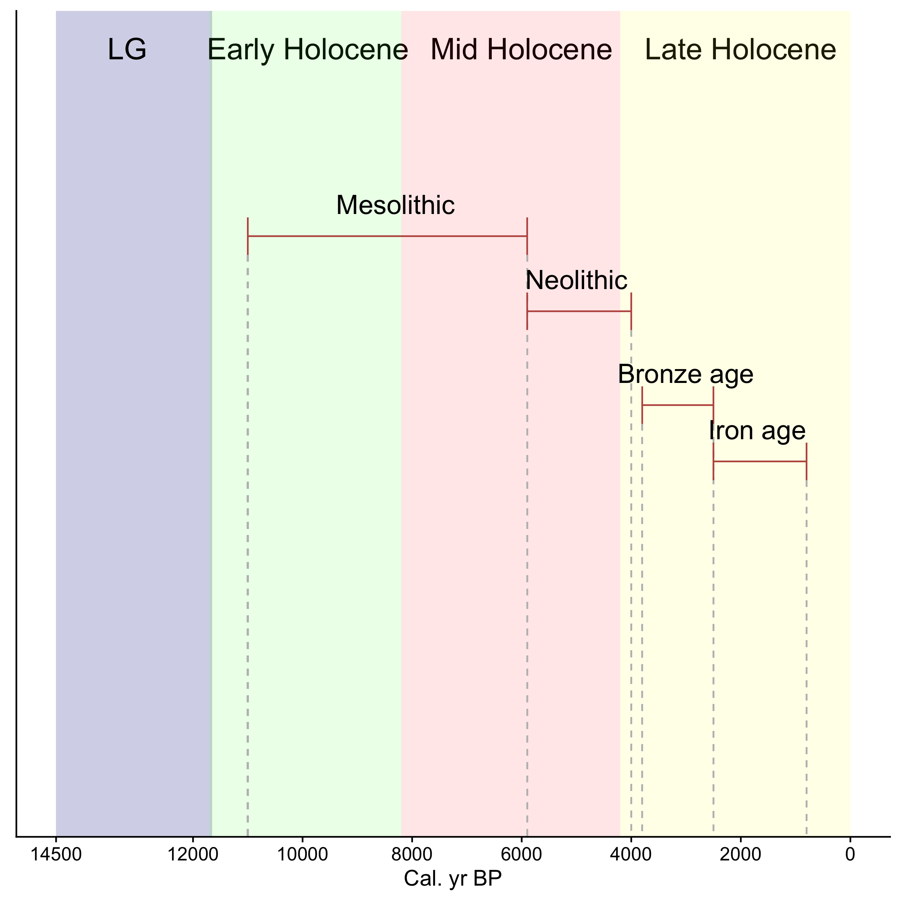
```

]

.right-column-txt[
- Late Glacial: Area covered by ice; tundra vegetation

- Mesolithic: More closed forests

- Neolithic: Broad-leaved forests replaced the birch- and pine-dominated forests; Some species related to grazed areas.

- Bronze age: Cereal cultivation; formation of Estonian alvars

- Iron age: Forest clearances; introduction of arable farming; increasing population density

.pull-right[.small[Poska & Saarse 1999; Poska et al. 2004]]]

---
class: inverse
### General expectations

- Number of species and functions in observed and dark diversity, as well as species pool size, will increase over time, especially after the LG period and during Late Holocene;

<br>
- Dark diversity might increase faster than observed (decreasing community completeness);

<br>
- Dark diversity will be composed mostly by species with limited dispersal capacity (lower height, high clonality) and low stress tolerance (low seed weight and high SLA).

---
class: inverse

### Pollen data and dark diversity estimation
.left-column-img[
```{r echo=FALSE, out.height= "20%", out.width="70%"}
# All defaults
library(knitr)
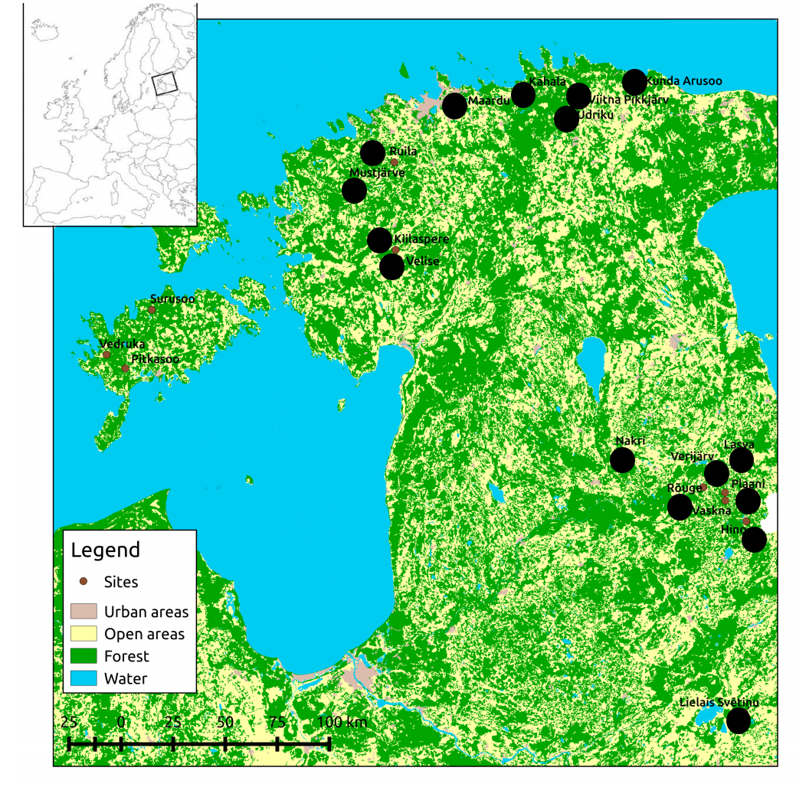
```
Reitalu et al. 2015]

.right-column-txt[
- Sedimentary pollen data was collected in 20 Lakes in Estonia and Latvia;

- Radiocarbon dates;

- Data covers 14500 yr time span;

<br>

- Dark diversity was estimated using the Hypergeometric method in "DarkDiv" package

- Community completeness = ln(observed/dark)
]
---
class: inverse

### Functional traits and analyses

- Four traits: 

  - Specific leaf area (SLA);
  
  - Plant height; 
  
  - Clonality;
  
  - Seed weight;

- Functional diversity - Trait probability density (TPD package);

- Functional composition - Mean trait value;

- Statistical analysis: Generalized additive models (GAMs)

---

class: inverse

#### .large[Observed and dark diversity increased over time]
.left-column-img[
```{r echo=FALSE, out.height= "60%", out.width="70%"}

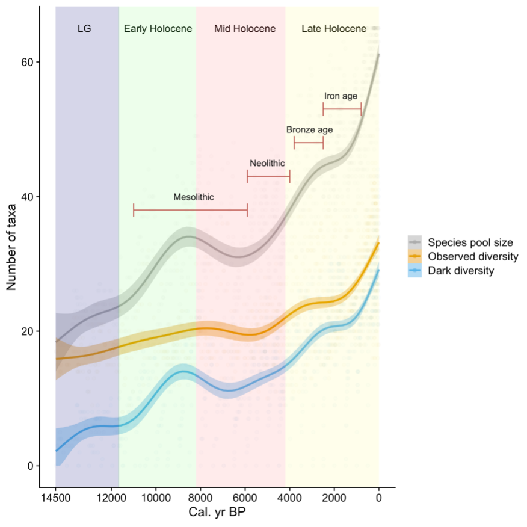
```
]
.right-column-txt[
- Observed and dark diversity increased after LG (**warming climate**);

- Dark diversity decreased sharply after 8.2kBP ("cooling period");

- Both observed and dark diversity increased during Late Holocene (~4kBP) (**Human activities**)

  - Cereal cultivation
  - Farming
  - Higher population density
]


---
class: inverse
#### .large[Functional observed and dark diversity increased over time too, but less pronounced]

.left-column-img[
```{r echo=FALSE, out.height= "60%", out.width="70%"}

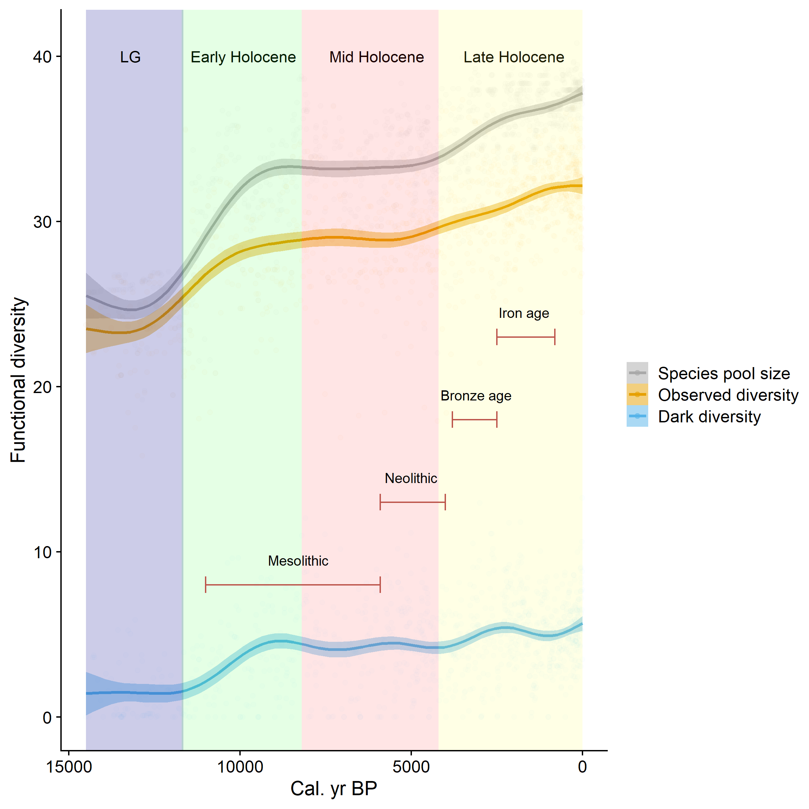
```
]

.right-column-txt[
- Functional observed and dark diversity increased after LG and during the Late Holocene

- Functional dark space volume is much smaller than observed space

  - High functional redundancy at the species pool level ]

---

class: inverse


#### .large[Taxonomic completeness decreased almost linearly]


```{r echo=FALSE, out.height= "20%", out.width="49%"}

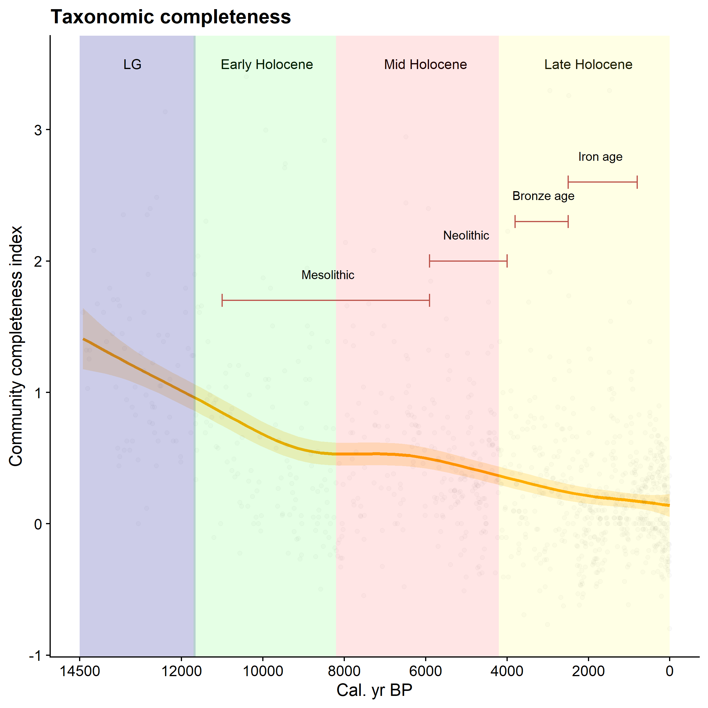
```


- Taxonomic community completeness decreased sharply over the LG until mid-Mesolithic (~9k years BP) and over the Neolithic until present
---
class: inverse


#### .large[Functional completeness decreased too, but less pronouced]


```{r echo=FALSE, out.height= "20%", out.width="60%"}

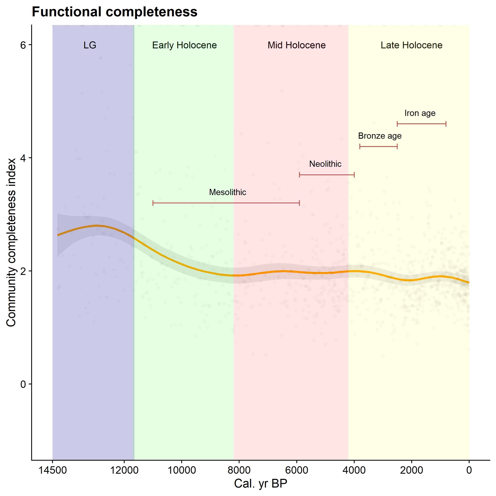
```

- Species pool functional volume saturated after the LG

- Species in dark diversity are highly functionally redundant
---
class: inverse

#### .large[Species in dark diversity are more stress-intolerant and dispersal limited]

```{r echo=FALSE, out.height= "20%", out.width="75%"}

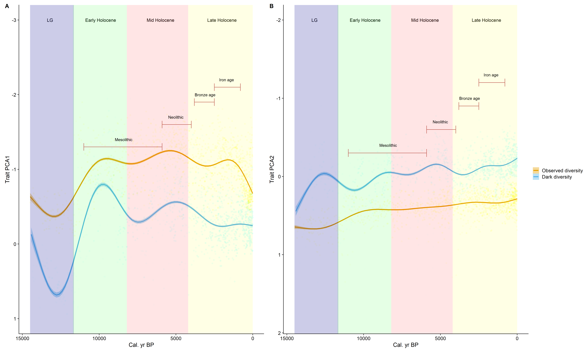
```

- Species in dark diversity are those with high SLA, low seed weight and  height (low dispersal/persistence ability)

- Sharp decrease in seed weight and height of dark diversity species (8.2kBP)
  - cooling period (harsher climate)

- Decrease in seed weight and height of observed diversity species (~200 yBP)
  - Species pool losses of taller and bigger-seeded species
  
---
class: inverse
### Take-home message

- Both taxonomic and functional diversity increased from LG to Holocene and during Late Holocene;
  - Warming
  - Human activities

- Despite the fast increase in dark diversity over the Holocene (lower community completeness), the functional completeness changed little

  - Functional redundancy at the species pool
  
- Dark diversity species are linked to low persistence and dispersal ability (large leaves, low seed weight and height);

- Dark diversity provides a valuable tool to assess how much, fast and in what direction species pools changed over millennial scales.

---
class: inverse, center, middle
## Find me on...

<br>

.large[
Twitter: <a href="http://twitter.com/diegopftrindade"><i class="fa fa-twitter fa-fw"></i>&nbsp; @diegopftrindade</a><br>

E-mail: <a href="mailto:dpftrindade@gmail.com"><i class="fa fa-google fa-fw"></i>&nbsp; dpftrindade@gmail.com</a><br>

Website: <a href="https://diegopftrindade.netlify.app"><i class="fa fa-link fa-fw"></i>&nbsp; diegopftrindade.netlify.app</a><br>


]
