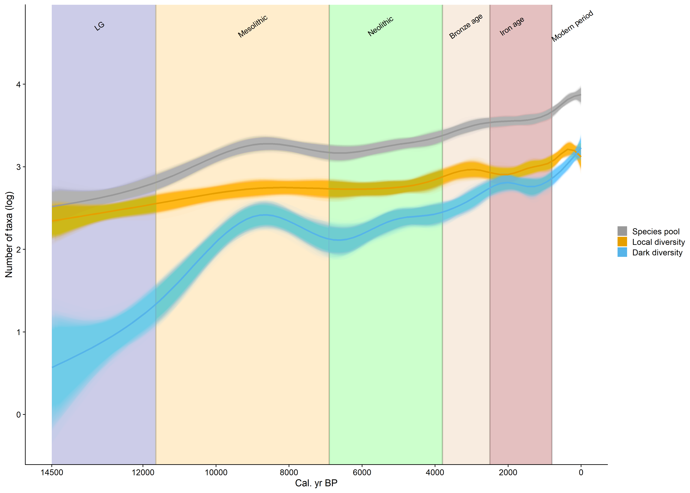
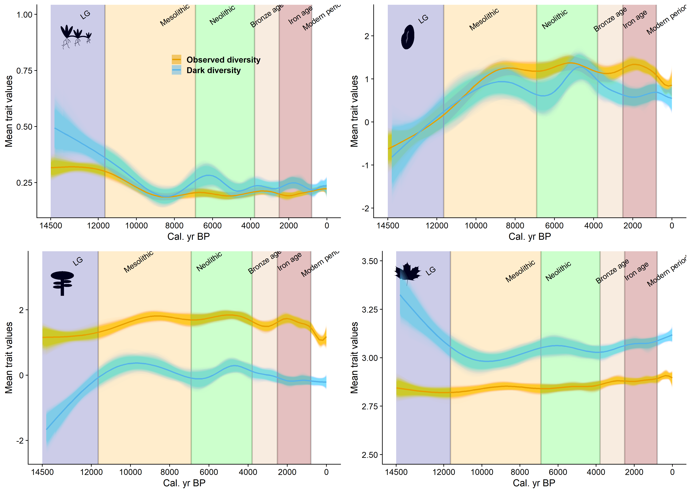
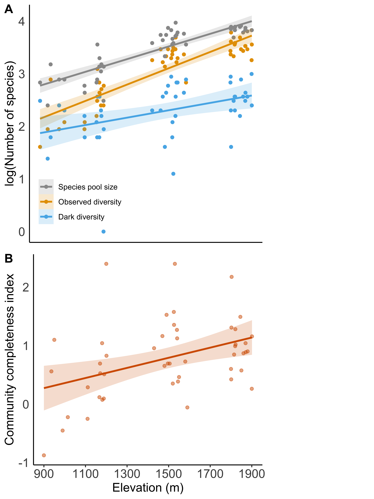
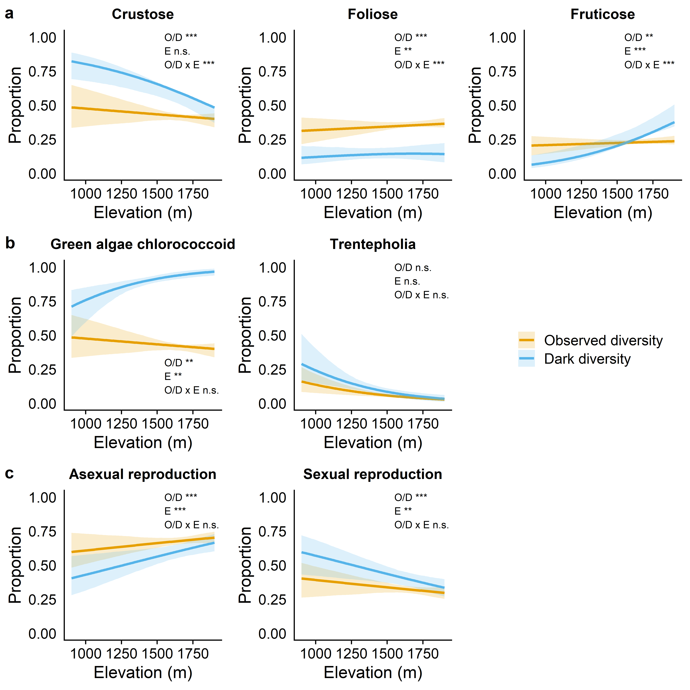

---
output:
  xaringan::moon_reader:
    css: ["my-css.css"]
    lib_dir: libs
    nature:
      highlightStyle: github
      highlightLines: true
      countIncrementalSlides: false
    includes:
      in_header: header.html
---


```{r setup, include=FALSE}
options(htmltools.dir.version = FALSE)
```


class: inverse, center, top

<div class="my-logo-left"></div>

<div class="my-logo-right"></div>

<br /> 
<br />
<br /><br />
<br />

# .small[Dark diversity dynamics linked to global change: taxonomic and functional perspective]

<br />
#### .large[Diego Trindade]
##### .large[University of Tartu]
##### .large[Macroecology workgroup]


---
class: inverse

### Dark diversity concept and the filtering metaphor


.pull-left[
```{r echo=FALSE, out.height= "20%", out.width="90%"}

include_graphics("assembly.jpeg")
```
]

<br>
<br>
--

.large[- Dark diversity: **set of suitable but locally absent species**;

<br>

- Important to shed light on processes affecting local community assembly]


---

class: inverse

### How site-specific species pools change over time?

.pull-left[
```{r echo=FALSE, out.height= "20%", out.width="90%"}

include_graphics("assembly.jpeg")
```
]

<br>

<br>


.large[- Species pools are not static but evolving components of biodiversity

<br>

- This is rather important in a global change context]

<br>

---
class: inverse

### Species gains and losses


.center[
```{r echo=FALSE, out.height= "20%", out.width="65%"}

include_graphics("https://diegopftrindade.netlify.app/img/fig_graphical_abs.png")
```
.pull-right[.small[Trindade, Carmona & Pärtel 2020, Global Change Biol.]]]


<br>
.large[- Both species and traits will flow within and into/out the site-specific species pool over time

- However, how both observed and dark diversity dynamics change over time is still unknown]

---

class: inverse

#### .large[Observed and dark diversity of pollen in Northeastern Europe]

```{r echo=FALSE, out.height= "20%", out.width="80%"}


```


- Observed and dark diversity increased after LG;

- Dark diversity increased rather fast after the LG and Mid-Holocene (6k years BP);

---
class: inverse

### What about the functional composition?

```{r echo=FALSE, out.height= "20%", out.width="75%"}


```

- Species in dark diversity are those with high SLA and low Height (low persistence ability)

- Peaks in functional composition change during Mid-Holocene (clonality, seed mass and SLA)


---
class: inverse

### Dark diversity of lichens along an elevational gradient in Italy


.pull-left[
```{r echo=FALSE, out.height= "20%", out.width="95%"}


```
.small[Trindade et al. Submitted]]

.pull-right[.large[-	Epiphytic lichens are under threat in both edges of the elevational gradient;


-	Restoration is needed at low elevations and conservation towards high elevations;
]]

---
class: inverse

### Functional dark diversity of lichens along an elevational gradient in Italy

.pull-left[
```{r echo=FALSE, out.height= "20%", out.width="100%"}


```
.small[Trindade et al. Submitted]]


.pull-right[.large[-	Macrolichens, Trentepohlia and sexual reproducing species should be prioritized;


- Photobiont limitation is more important than dispersal
]]

---
class: inverse

### Other general interests

.large[- Community assembly (filtering process, functional ecology)

  - Tropical dry forests
  
  - European Grasslands
  
<br>
  
- Regenerating forests

  - Forest resilience
  
  - Restoration and conservation
]

---
class: inverse, center, middle
## Find me at...

<br>

.large[
<a href="mailto:dpftrindade@gmail.com"><i class="fa fa-google fa-fw"></i>&nbsp; dpftrindade@gmail.com</a><br>

<a href="https://diegopftrindade.netlify.app"><i class="fa fa-link fa-fw"></i>&nbsp; diegopftrindade.netlify.app</a><br>

<a href="http://twitter.com/diegopftrindade"><i class="fa fa-twitter fa-fw"></i>&nbsp; @diegopftrindade</a><br>

<a href="http://github.com/diegotrindade"><i class="fa fa-github fa-fw"></i>&nbsp; @diegotrindade</a><br>

]
