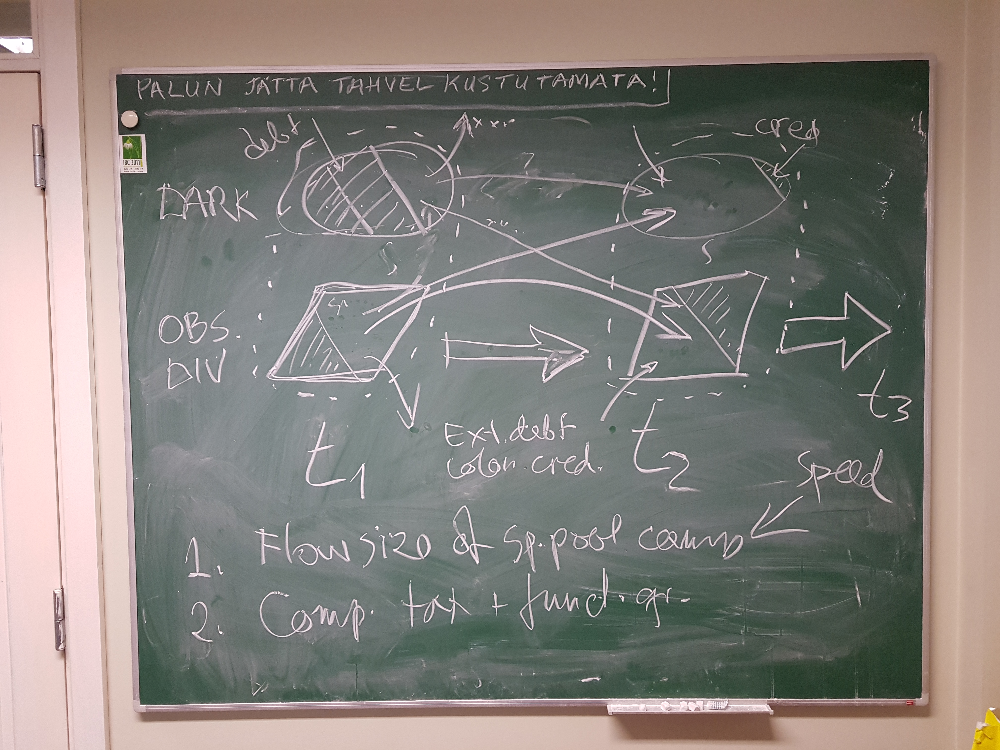
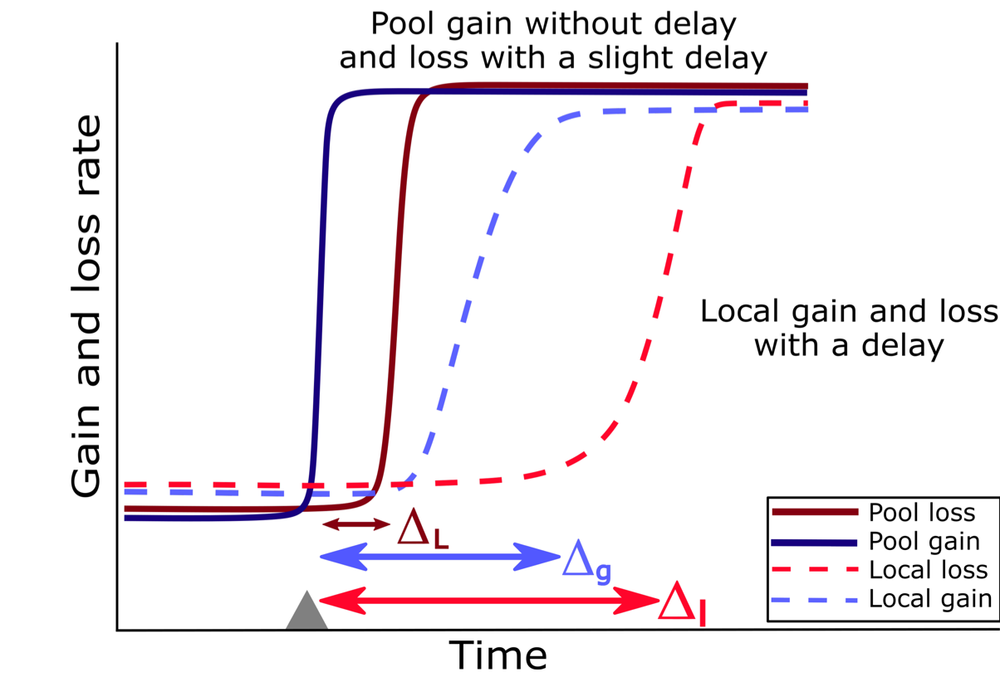
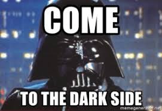

---
output:
  xaringan::moon_reader:
    css: ["default", "my-css.css", 'metropolis-fonts']
    lib_dir: libs
    nature:
      highlightStyle: github
      highlightLines: true
      countIncrementalSlides: false
      seal: false
    
      
---

```{r setup, include=FALSE}
options(htmltools.dir.version = FALSE)
```

class: inverse, center, top

background-image: url('spotlight.jpg')
background-size: 100% 100%

<div class="my-logo-left"></div>

<div class="my-logo-right"></div>

<br /> 
<br />
<br /><br />
<br />
<br />
<br />

# .small[Biodiversity change in the Anthropocene: bringing the dark diversity into the spotlight]

<br />

#### .large[Diego P. F. Trindade]

#### .large[Supervisor: Meelis Pärtel]

#### .large[Co-supervisor: Carlos P. Carmona]


---
class: inverse, left, top

### Biodiversity change: spatial scale issue

<br><br>

.right[Vellend et al. 2017 Annual Reviews]

---

class: inverse, left, top

### Biodiversity change: temporal issue


```{r echo=FALSE, out.height= "70%", out.width="80%"}
# All defaults
library(knitr)
include_graphics("https://ars.els-cdn.com/content/image/1-s2.0-S016953471300027X-gr1.jpg")

```

.right[Hylander & Ehrlér 2013 TREE]

---


class: inverse, left, top

### How to tackle both scale and temporal issues?

.center2[
```{r echo=FALSE, out.height= "50%", out.width="90%"}
# All defaults
library(knitr)
include_graphics("obs.dark.png")
```
]


<br><br><br><br><br><br><br><br><br><br><br><br><br><br><br><br><br><br>
.pull-right[Bennett et al. 2016 Ecology Letters]

---
class: inverse, left, top

### How to tackle both scale and temporal issues?

.center2[
```{r echo=FALSE, out.height= "50%", out.width="90%"}
# All defaults
library(knitr)
include_graphics("obs.dark.png")
```
]

<br><br><br><br><br><br><br><br><br><br><br><br><br><br><br><br><br><br>

.large[We hypothesize that by considering both observed and dark diversity throughout time we can tackle spatial scale and temporal issues.]

---

class: inverse, left, top

### Dark diversity: definition and estimation

- .large[The term dark diversity was borrowed from the dark matter idea in asthrophysics;]

- .large[Dark diversity corresponds to the species that could potentially be present in a local community but are currently absent;]

- .large[Like dark matter, dark diversity cannot be seen but estimated.]

--

<!--
.center[
```{r echo=FALSE, out.height= "50%", out.width="50%"}
# All defaults
library(knitr)
include_graphics("beals.png")
```
]

.pull-right[Lewis et al. 2016 Methods Eco. Evol.]
-->
---
class: inverse, left, top

### Very first conceptual idea

```{r echo=FALSE, out.height= "90%", out.width="120%"}
# All defaults
library(knitr)

```

---

class: inverse, left, top

### Species gains and losses

- .large[We hypothesize four "biodiversity flows" during global change]

```{r echo=FALSE, out.height= "70%", out.width="90%"}
# All defaults
library(knitr)
include_graphics("fig1a.png")
```
.right[Trindade et al. submitted]

--


---

class: inverse, left, top

### Species gains and losses

```{r echo=FALSE, out.height= "50%", out.width="70%"}
# All defaults
library(knitr)
include_graphics("fig1c.png")
```
.right[Trindade et al. submitted]

---
class: inverse, left, top

### Time-delay model

<br>
```{r echo=FALSE, out.height= "50%", out.width="90%"}
# All defaults
library(knitr)

```

---

class: inverse, left, top

### Simulation results


```{r echo=FALSE, out.height= "60%", out.width="90%"}
# All defaults
library(knitr)
include_graphics("fig2.png")
```

---
class: inverse, left, top
### Next steps

- .large[Applying the conceptual idea using individual-based models and real datasets (i.e. Pollen data, North American Breeding Bird Survey, Biotime data etc.)]
.pull-right[
```{r echo=FALSE, out.height= "20%", out.width="80%"}
# All defaults
library(knitr)
include_graphics("https://media.giphy.com/media/p5gSU97t34rRe/giphy.gif")
```
]

---
class: inverse, left, top
### Pollen data - observed and dark diversity


```{r echo=FALSE, out.height= "90%", out.width="120%"}
# All defaults
library(knitr)
include_graphics("pollen_obs_dark.png")
```

---
class: inverse, left, top

### Pollen data - species gain and loss rate
 
```{r echo=FALSE, out.height= "70%", out.width="120%"}
# All defaults
library(knitr)
include_graphics("pollen_gainloss_rate.png")
```
---
class: inverse, left, top

### Pollen data - functional traits

- .large[Herbs]
<br>
<br>
<br>
```{r echo=FALSE, out.height= "100%", out.width="100%"}
# All defaults
library(knitr)
include_graphics("herb_pollen_fig1.png")


```


---

class: inverse, left, top

### Pollen data - functional traits

- .large[Trees]
<br>
<br>
<br>
```{r echo=FALSE, out.height= "40%", out.width="100%"}
# All defaults
library(knitr)
include_graphics("tree_pollen_fig1.png")


```
---
class: inverse, left, top

### Individual-based model

```{r echo=FALSE, out.height= "30%", out.width="100%"}
# All defaults
library(knitr)
include_graphics("graph.gif")


```


---
class: inverse, left, top
### Individual-based model

```{r echo=FALSE, out.height= "30%", out.width="100%"}
# All defaults
library(knitr)
include_graphics("ind_basee.png")


```

---
class: inverse, left, top
### Individual-based model - Extinction debt


```{r echo=FALSE, out.height= "20%", out.width="100%"}
# All defaults
library(knitr)
include_graphics("extd.png")


```


---
class: inverse, left, top

### Take-home message

- .large[Dark diversity allows us to better integrate different scales;]

- .large[Dark diversity might offer a temporary buffer for locally extinct species;]

- .large[By tracking both observed and dark diversity dynamics over time we are more equipped to predict and mitigate species gains and loss;]

- .large[Such information might help us to better delineate restoration and conservation activities]

.pull-right[
```{r echo=FALSE, out.height= "70%", out.width="80%"}
# All defaults
library(knitr)

```
]
