---
output:
  xaringan::moon_reader:
    css: ["default", "my-css.css", 'metropolis-fonts']
    lib_dir: libs
    nature:
      highlightStyle: github
      highlightLines: true
      countIncrementalSlides: false
      seal: false
    
      
---

```{r setup, include=FALSE}
options(htmltools.dir.version = FALSE)
```

class: inverse, center, top

background-image: url('spotlight.jpg')
background-size: 100% 100%

<div class="my-logo-left"></div>

<div class="my-logo-right"></div>

<br /> 
<br />
<br /><br />
<br />
<br />
<br />

# .small[Biodiversity change in the Anthropocene: bringing the dark diversity into the spotlight]

<br />

#### .large[Diego P. F. Trindade]

#### .large[Supervisor: Meelis Pärtel]

#### .large[Co-supervisor: Carlos P. Carmona]


---
class: inverse, left, top

## Biodiversity change: scale and temporal issues

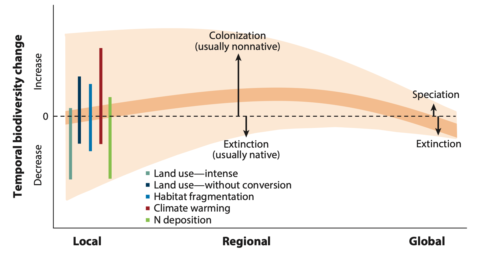
.right[Vellend et al. 2017 Annual Reviews]

---

class: inverse, left, top

### Biodiversity change: scale and temporal issues


```{r echo=FALSE, out.height= "70%", out.width="80%"}
# All defaults
library(knitr)
include_graphics("https://ars.els-cdn.com/content/image/1-s2.0-S016953471300027X-gr1.jpg")
```

.right[Hylander & Ehrlér 2013 TREE]

---

class: inverse, left, top

### How to tackle both scale and temporal issues?

.center2[
```{r echo=FALSE, out.height= "50%", out.width="90%"}
# All defaults
library(knitr)
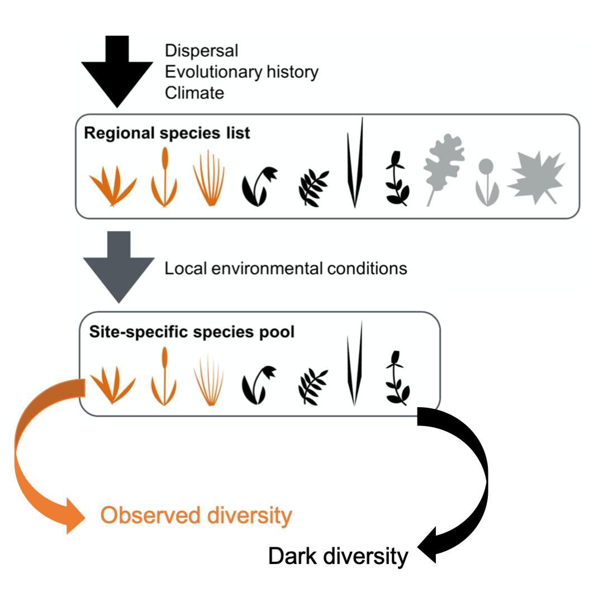
```
]


<br><br><br><br><br><br><br><br><br><br><br><br><br><br><br><br><br><br>
.pull-right[Bennett et al. 2016 Ecology Letters]

---
class: inverse, left, top

### How to tackle both scale and temporal issues?

.center2[
```{r echo=FALSE, out.height= "50%", out.width="90%"}
# All defaults
library(knitr)

```
]

<br><br><br><br><br><br><br><br><br><br><br><br><br><br><br><br><br><br>

.large[We hypothesize that by considering both observed and dark diversity throughout time we can tackle spatial scale and temporal issues.]

---

class: inverse, left, top

### Dark diversity: what is it and why?

- Dark diversity has been inspired by the "dark matter" idea in physics

- By definition: Dark diversity corresponds to the species that can potentially be present in a local community but are currently absent

- Like the dark matter, dark diversity cannot be seen but estimated.

--

<br><br><br>
.center[
```{r echo=FALSE, out.height= "50%", out.width="50%"}
# All defaults
library(knitr)
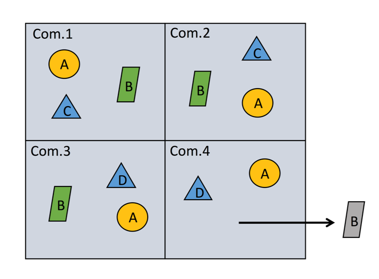
```
]

.pull-right[Lewis et al. 2016 Methods Eco. Evol.]


---

class: inverse, left, top

### Biodiversity flows

```{r echo=FALSE, out.height= "50%", out.width="80%"}
# All defaults
library(knitr)
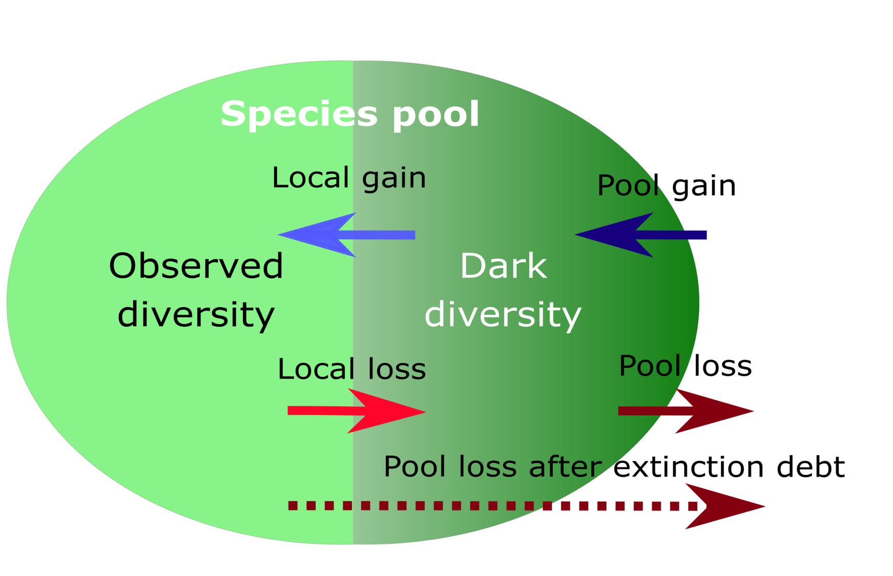
```
.right[Trindade et al. Under review - Global Change Biology]

---

class: inverse, left, top

### Species gain and loss

```{r echo=FALSE, out.height= "50%", out.width="70%"}
# All defaults
library(knitr)
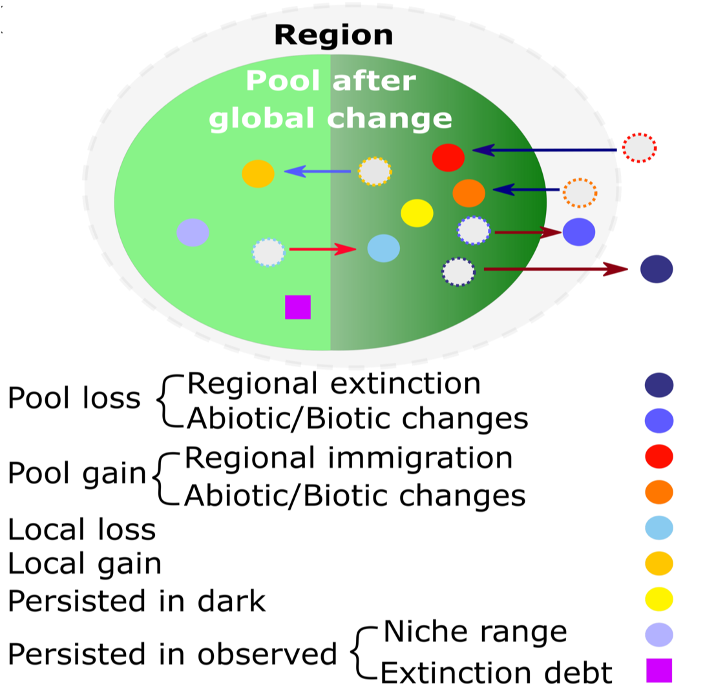
```
.right[Trindade et al. Under review - Global Change Biology]

---

### Simple time-delay model

We created a simple model to test the four hypothesized flows

---

class: inverse, left, top

### Simulation


```{r echo=FALSE, out.height= "40%", out.width="85%"}
# All defaults
library(knitr)
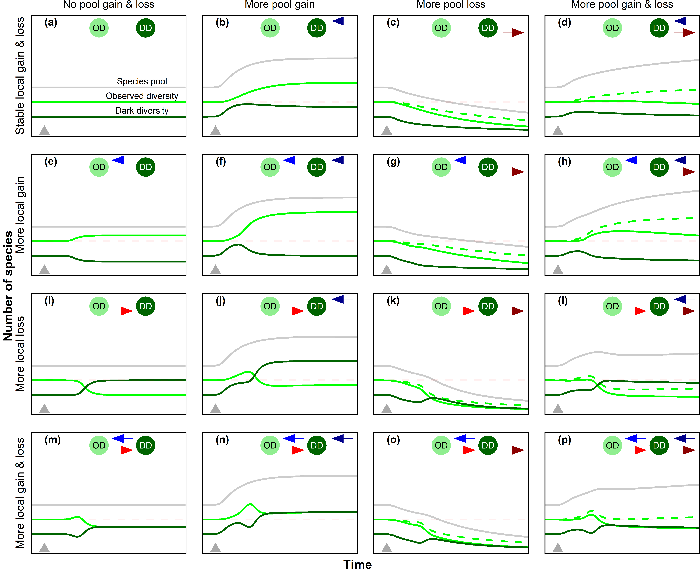
```


---

Therefore, our guess is:

- By looking at the dark diversity we have both faces of the coin


- Species going locally extinct might persist in dakr diversity for some time


- After a change, before arriving in the local site, new species might be detected in the dark diversity.


- In summary it gives us time either to protect species from regional extinction or to facilitate species colonization (restoration) or prevent some species to colonize (invasive species).

---

### Further steps

- Applying the conceptual idea using individual-based models and real datasets (i.e. Pollen data, North American Breeding Bird Survey, Biotime data etc.)

---
class: inverse, left, top
### Pollen data


```{r echo=FALSE, out.height= "90%", out.width="120%"}
# All defaults
library(knitr)
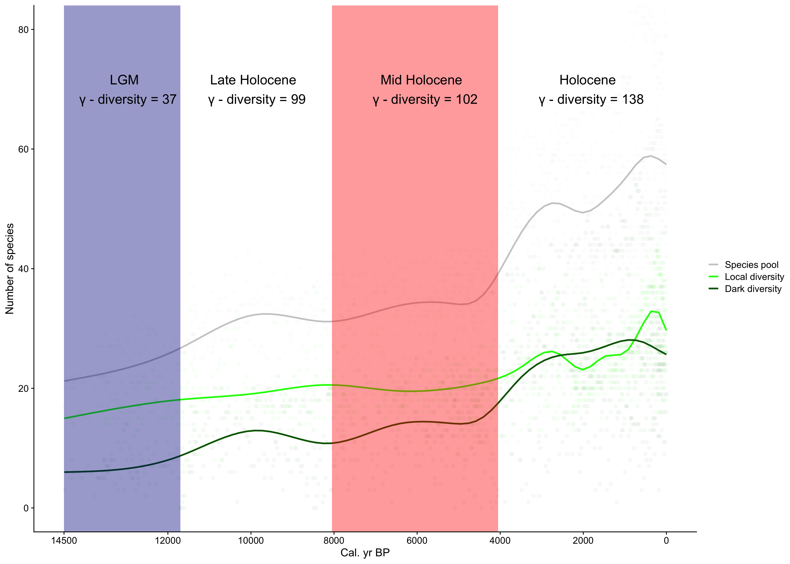
```


---
class: inverse, left, top

### Pollen data

```{r echo=FALSE, out.height= "70%", out.width="120%"}
# All defaults
library(knitr)
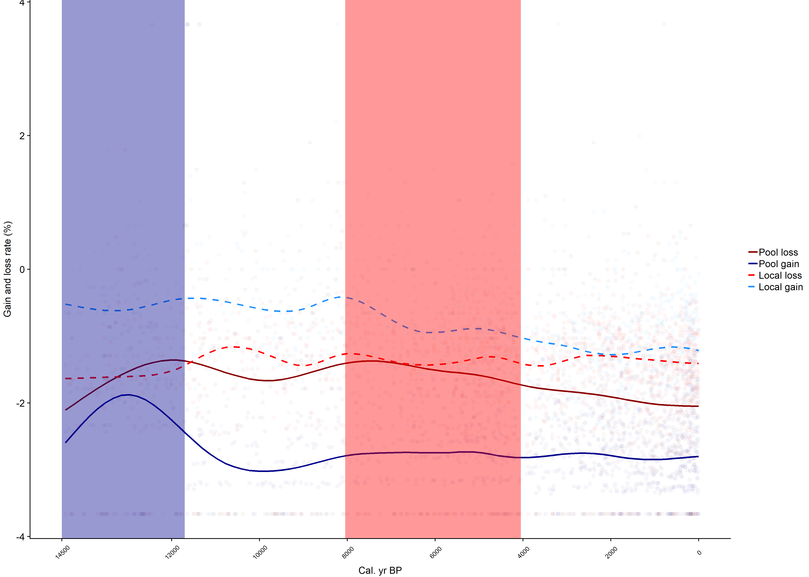
```
---
class: inverse, left, top

### Pollen data
- .left[Herbs]
```{r echo=FALSE, out.height= "30%", out.width="80%"}
# All defaults
library(knitr)
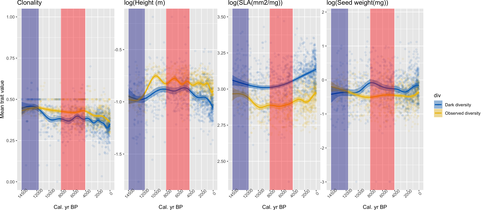


```
- .left[Trees]
```{r echo=FALSE, out.height= "30%", out.width="80%"}
# All defaults
library(knitr)
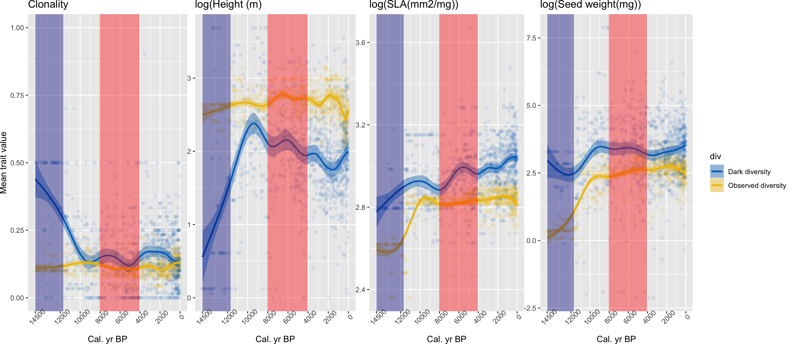


```
---
class: inverse, left, top
### Individual-based model

```{r echo=FALSE, out.height= "30%", out.width="100%"}
# All defaults
library(knitr)
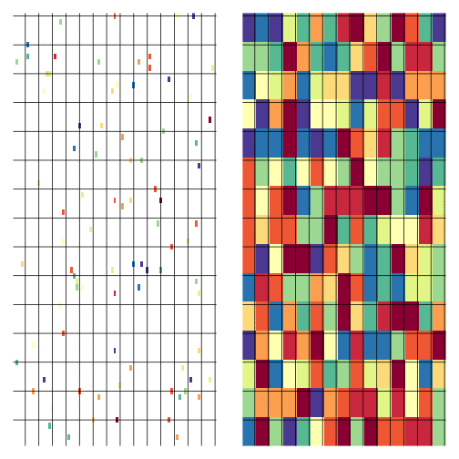


```


---
class: inverse, left, top
### Individual-based model

```{r echo=FALSE, out.height= "30%", out.width="100%"}
# All defaults
library(knitr)
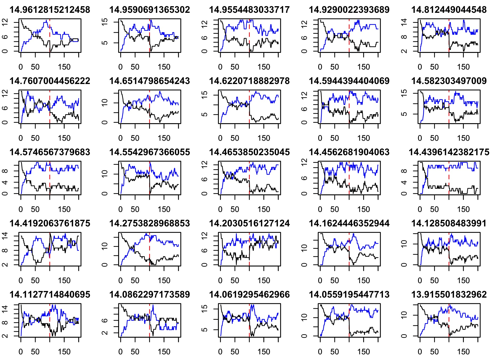


```

---
class: inverse, left, top
### Individual-based model


```{r echo=FALSE, out.height= "20%", out.width="100%"}
# All defaults
library(knitr)
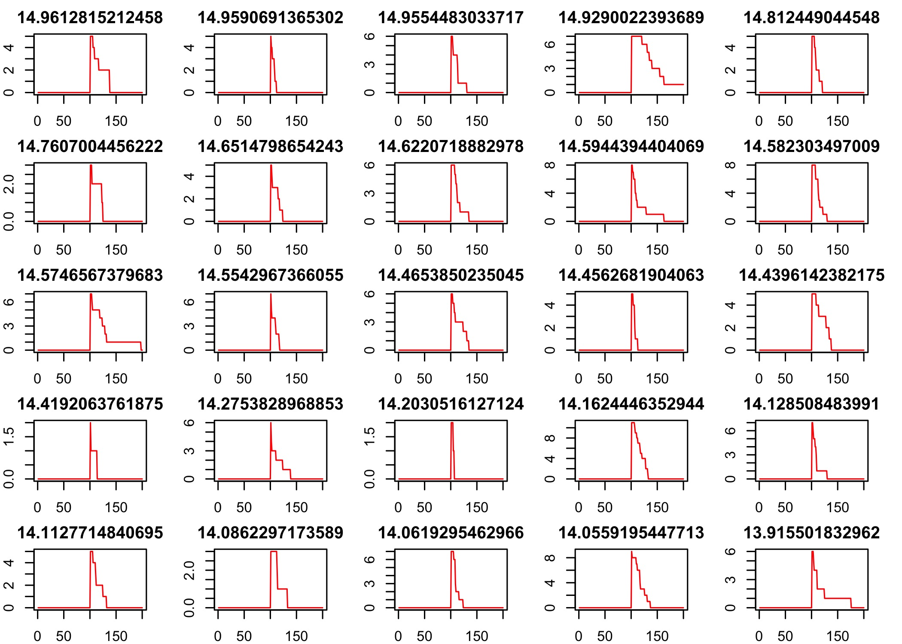


```

---
class: inverse, left, top
### Take-home message

- Dark diversity allows us to better integrate different scales

- Dark diversity might offer a temporary buffer for local extinctions which are potentially reversible

- By tracking both observed and dark diversity we can be more equiped to predict species gains and loss

- Such information might help us to better deliniate restoration and conservation activities


